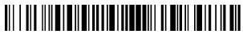

# HallsByra.Code128

[](https://www.nuget.org/packages/HallsByra.Code128/)

An optimizing [Code 128](https://en.wikipedia.org/wiki/Code_128) encoder for producing barcode glyphs that can be rendered using a barcode font such as [Libre Barcode 128](https://fonts.google.com/specimen/Libre+Barcode+128).

## Getting started
Install the NuGet.
```
dotnet add package HallsByra.Code128
```

Encode your strings.

```cs
string outputGlyphs = Code128Encoder.Encode("input symbols");
```

Render the `outputGlyphs` string using the Libre Barcode 128 font.

|Input|Encoded|Rendered|
|---|---|---|
`input symbols`|`ÌinputÂsymbolsIÎ`| 

## Notes
* Optimization - I believe the implementation will find an optimal encoding for each input, but I'm not sure how to prove it.
* Performance - There are plenty of possibilities for performance tuning, but I've prioritized readability.
